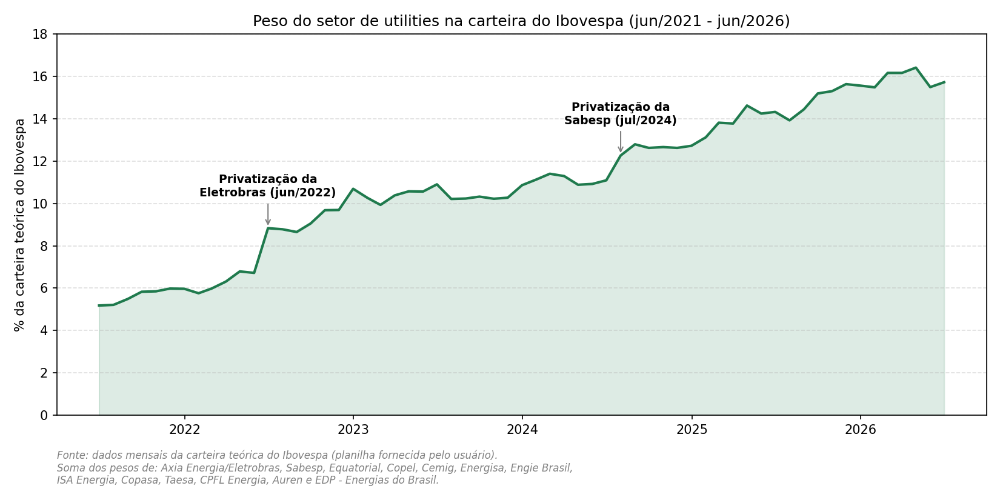

# O peso das utilities no Ibovespa nos últimos 5 anos (2021-2026)

## Resumo

Com base na carteira teórica mensal do Ibovespa, o setor de *utilities*
(energia elétrica, saneamento e gás) **praticamente triplicou seu peso** no
índice entre junho de 2021 e junho de 2026, saindo de **5,2%** para **15,7%**
da carteira. O crescimento não foi linear: dois saltos concentrados coincidem
exatamente com as privatizações da Eletrobras (2022) e da Sabesp (2024), além
de uma trajetória de alta consistente ao longo de 2025.

## Linha do tempo

- **Jun/2021 a mai/2022**: peso estável, entre 5,2% e 6,8%, com o setor
  pulverizado entre Cemig, Copel, CPFL, Equatorial, Energisa, Engie, Taesa,
  ISA Energia, Copasa, EDP e Sabesp (esta última ainda com peso pequeno,
  ~0,7%).
- **Jun/2022 — privatização da Eletrobras**: o peso do setor salta de 6,72%
  para 8,83% em um único mês — alta de mais de 2 pontos percentuais,
  praticamente toda explicada pelo aumento da participação da então ELET3
  (hoje AXIA3, após o rebranding para Axia Energia em nov/2025).
- **Jul/2022 a jun/2024**: alta gradual e consistente, de 8,8% para ~11%,
  puxada principalmente pela valorização de Equatorial e pelo crescimento
  contínuo de Sabesp (que já passava de 1,3% no início de 2024).
- **Jul/2024 — privatização da Sabesp**: novo salto, de 11,09% para 12,26% em
  um mês — o peso de SBSP3 mais que dobra (de ~1,25% para ~2,22%) com a
  conclusão da oferta e a entrada da Equatorial como acionista de referência.
- **2025**: trajetória de alta praticamente ininterrupta, de 12,7% (dez/2024)
  para 15,6% (dez/2025), período em que o setor se consolidou entre os mais
  relevantes do índice, beneficiado pelo caráter defensivo das utilities e
  pela perspectiva de queda de juros.
- **2026 (até jun)**: peso oscila na casa dos 15-16%, mantendo o patamar mais
  alto de toda a série.

## Gráfico

O gráfico foi construído somando, mês a mês, o peso de todas as empresas de
energia elétrica, saneamento e gás presentes na carteira teórica do Ibovespa:
Axia Energia/Eletrobras (AXIA3/AXIA6/AXIA7, ex-ELET3/ELET6), Sabesp (SBSP3),
Equatorial (EQTL3), Copel (CPLE3/5/6), Cemig (CMIG4), Energisa (ENGI11),
Engie Brasil (EGIE3), ISA Energia/CTEEP (ISAE4), Copasa (CSMG3), Taesa
(TAEE11), CPFL Energia (CPFE3), Auren (AURE3) e EDP - Energias do Brasil
(ENBR3).

## Fontes

- Carteira teórica mensal do Ibovespa, jun/2021-jun/2026 (dados fornecidos pelo usuário)
- [Seu Dinheiro - Privatização da Eletrobras (2022)](https://www.seudinheiro.com/2022/empresas/privatizacao-da-eletrobras-preco-por-acao-elet3-julw/)
- [Seu Dinheiro - Privatização da Sabesp: maior oferta de saneamento da história (2024)](https://www.seudinheiro.com/2024/empresas/sabesp-sbsp3-privatizacao-maior-oferta-saneamento-historia-rsgp-ccgg/)
- [InfoMoney - Axia, ex-Eletrobras, estreia novo ticker na B3 (nov/2025)](https://www.infomoney.com.br/mercados/axia3-axia-ex-eletrobras-estreia-novo-ticker-na-b3-nesta-segunda/)
- [Monte Bravo - Utilities: o setor de maior destaque na Bolsa em 2025](https://www.montebravo.com.br/blog/investimentos/utilities/)
